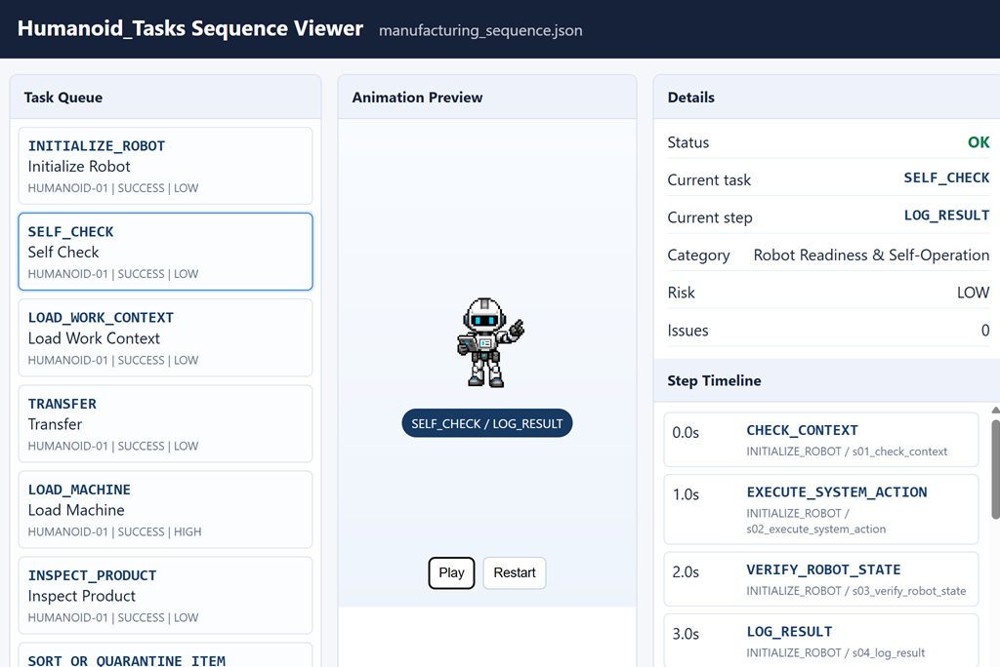

# HumanoidSim_v0.1

HumanoidSim은 휴머노이드 로봇을 위한 task, primitive, state, incident 정의 및 검증 라이브러리입니다.



## 역할

HumanoidSim은 휴머노이드가 수행할 수 있는 일을 `TaskSpec`으로 정의하고, task를 이루는 실행 단계를 `StepCall`과 `Primitive Skill`로 정의합니다. ManSim 같은 시뮬레이션 runtime은 이 정의를 import해서 특정 환경과 시나리오에서 실제로 어떤 일이 벌어지는지 관찰합니다.

현재 버전은 `v0.1`이며 제조 core task 82개와 primitive skill 59개를 포함합니다.

## Task 구조

| Level | 의미 | 구조 규칙 |
| --- | --- | --- |
| `PRIMITIVE_SKILL` | 더 이상 쪼개지지 않는 최소 실행 skill | child step을 갖지 않습니다. |
| `ATOMIC_TASK` | primitive skill만으로 구성된 실행 가능한 단일 task | 모든 `StepCall.call_code`가 primitive를 참조해야 합니다. |
| `COMPOSITE_TASK` | 하위 task를 직접 포함하는 workflow | 최소 1개 이상의 child task call을 포함해야 합니다. orchestration primitive를 함께 가질 수 있습니다. |

`COMPOSITE_TASK`는 단순히 긴 primitive sequence가 아닙니다. 예를 들어 `REPLENISH_MATERIAL`은 `CHECK_REQUEST -> PRIMITIVE_IDENTIFY_ITEM -> TRANSFER -> VERIFY_LEVEL_OR_QUANTITY -> UPDATE_RECORD` 구조이고, 여기서 `TRANSFER`는 primitive가 아니라 `ATOMIC_TASK` child call입니다.

`StepCall.call_code`는 primitive code뿐 아니라 task code도 참조할 수 있습니다. 이때 `expected_level`은 필수이며 `PRIMITIVE_SKILL`, `ATOMIC_TASK`, `COMPOSITE_TASK` 중 실제 참조 대상의 level과 일치해야 합니다.

## Task 분류

82개 task는 13개 제조 운영 category로 분류됩니다.

| ID | Category | Count |
| --- | --- | ---: |
| A | Robot Readiness & Self-Operation | 8 |
| B | Mobility, Intralogistics & Material Flow | 5 |
| C | Machine Tending & Equipment Operation | 7 |
| D | Assembly, Fastening & Connection | 9 |
| E | Material Application, Dispensing & Sealing | 5 |
| F | Processing, Rework & Surface Treatment | 5 |
| G | Quality Inspection, Measurement & Testing | 7 |
| H | Maintenance, Repair & Calibration | 7 |
| I | Cleaning, 5S, EHS & Safety Patrol | 6 |
| J | Packaging, Unitization & Shipping | 5 |
| K | Warehouse, Inventory & Material Control | 6 |
| L | MES, Traceability & Digital Operations | 6 |
| M | Human Collaboration & Operator Assistance | 6 |

Level 기준으로는 `ATOMIC_TASK` 50개, `COMPOSITE_TASK` 32개입니다.

## Public API

대표 API는 다음과 같습니다.

```python
from humanoidsim import (
    HumanoidProfile,
    load_task_catalog,
    validate_task_sequence,
    simulate_task_sequence,
    expand_task_steps,
)
```

`expand_task_steps(task_code, args, catalog=...)`는 nested composite task를 펼쳐 parent task, child task, primitive leaf를 모두 포함한 plan row를 반환합니다. 각 row에는 `path`, `depth`, `parent_task_code`, `call_code`, `call_level`, `step_id`, `args`, `depends_on`이 들어갑니다.

## Humanoid State Model

Task와 State는 분리합니다.

| 개념 | 의미 |
| --- | --- |
| Task | 휴머노이드가 달성해야 하는 목표 작업입니다. 예: `TRANSFER`, `INSPECT_PRODUCT`, `REPLENISH_MATERIAL` |
| Primitive | Task를 이루는 실행 단계입니다. 예: `NAVIGATE_TO`, `GRASP`, `PLACE` |
| State | 특정 시점의 휴머노이드 운용 상태입니다. 예: `availability=EXECUTING`, `mobility=NAVIGATING` |

State는 네 축으로 정의합니다.

| 축 | 상태 |
| --- | --- |
| Availability | `AVAILABLE`, `ASSIGNED`, `EXECUTING`, `WAITING`, `BLOCKED`, `OFFLINE`, `DISABLED` |
| Mobility | `STATIONARY`, `NAVIGATING`, `DOCKING` |
| Power | `POWER_NORMAL`, `POWER_LOW`, `POWER_CRITICAL`, `DEPLETED`, `CHARGING` |
| Manipulation | `FREE`, `REACHING`, `HOLDING`, `PLACING` |

상태 축, snapshot schema, lifecycle mapping, primitive state hint는 [State Reference](docs/state_reference.md)를 참고합니다.

## Primitive State Relation

HumanoidSim은 primitive별 state 의미를 정의합니다. 정상적으로 실행 중인 모든 primitive는 Availability State에서 `EXECUTING`입니다. Mobility와 Manipulation은 primitive의 `metadata.state.allowed`와 `metadata.state.effects`에 따라 결정됩니다.

- `NAVIGATE_TO`: 실행 중 `mobility=NAVIGATING`, 종료 후 `STATIONARY`
- `ALIGN`: 정렬/도킹 중 `mobility=DOCKING`, 종료 후 `STATIONARY`
- `REACH_TO`: 실행 중 `manipulation=REACHING`
- `GRASP`, `LIFT`: 실행 중 `manipulation=HOLDING`
- `PLACE`, `RELEASE`: 실행 중 `manipulation=PLACING`, 종료 후 `FREE`
- 확인/기록 계열 primitive: 보통 `mobility=STATIONARY`이며 cargo 관련 manipulation state는 caller event에 따라 유지됩니다.

전체 primitive별 Availability, Mobility, Manipulation 관계는 [Primitive Reference](docs/primitives_reference.md)에 정리되어 있습니다.

## Humanoid Incident Model

Incident는 새로운 state가 아니라 `StateReason + recovery protocol`입니다. 예를 들어 `GRIP_FAILED`가 발생하면 Availability는 `BLOCKED`로 전이되고, reason에는 incident code/category/severity/recovery protocol이 함께 기록됩니다. 짧은 traffic wait나 operator readiness처럼 예상 가능한 대기는 `WAITING`, 방전이나 심각한 hardware fault처럼 로봇 자체가 작업 불가인 경우는 `DISABLED`를 사용합니다.

Incident code는 정의 단계부터 uppercase canonical code를 사용합니다. 예: `OBJECT_RECOGNITION_FAILED`, `GRIP_FAILED`, `ITEM_DROPPED`, `RESOURCE_PREEMPTED`, `UNKNOWN`

Incident taxonomy는 제조 환경에만 묶이지 않도록 perception/identification, manipulation/payload, resource/environment, motion/traffic, power/hardware, system/communication, safety/human interaction, unknown으로 나뉩니다. 자세한 code와 복구 절차는 [Incident Reference](docs/incident_reference.md)를 참고합니다.

Recovery protocol의 모든 step은 기존 HumanoidSim primitive 또는 task를 참조해야 합니다. 이 관계는 `validate_incident_schema()`에서 검증됩니다.

## 구성

- `src/humanoidsim/task_schema.py`: task, step, resource, registry validation schema
- `src/humanoidsim/state_schema.py`: humanoid state enum, snapshot, primitive state profile, transition API
- `src/humanoidsim/incident_schema.py`: incident taxonomy, recovery protocol, incident transition event
- `src/humanoidsim/catalog.py`: task catalog loader
- `src/humanoidsim/execution.py`: profile validation, nested expansion, sequence simulation
- `src/humanoidsim/viewer.py`: task sequence HTML viewer export
- `data/tasks/`: 82개 core task JSON
- `data/primitives/`: primitive skill JSON
- `data/task_catalog_core.json`: catalog index
- `data/state_schema_core.json`: state axis, primitive state profile, transition graph
- `data/incident_schema_core.json`: incident taxonomy와 recovery protocol
- `docs/tasks_reference.md`: task 전체 reference
- `docs/primitives_reference.md`: active/registry primitive reference
- `docs/state_reference.md`: state axis, snapshot, lifecycle, transition reference
- `docs/incident_reference.md`: incident taxonomy, state reason, recovery protocol reference

## Reference

- [Task Reference](docs/tasks_reference.md): 82개 task의 level, category, input, resource, nested sequence를 정리합니다.
- [Primitive Reference](docs/primitives_reference.md): active/registry primitive 차이, primitive별 state relation, 사용 task를 정리합니다.
- [State Reference](docs/state_reference.md): Availability, Mobility, Power, Manipulation 축과 `HumanoidStateSnapshot` 사용 규칙을 정리합니다.
- [Incident Reference](docs/incident_reference.md): incident taxonomy, 기본 state transition, recovery protocol을 정리합니다.

## 실행

가상환경을 활성화합니다.

```powershell
cd C:\Github\HumanoidSim
.\.venv\Scripts\Activate.ps1
```

editable package로 설치합니다.

```powershell
.\.venv\Scripts\python.exe -m pip install -e C:\Github\HumanoidSim
```

catalog를 검증합니다.

```powershell
.\.venv\Scripts\python.exe -m humanoidsim validate-catalog
```

예제 sequence를 검증합니다.

```powershell
.\.venv\Scripts\python.exe -m humanoidsim validate-sequence examples\manufacturing_sequence.json
```

viewer를 생성합니다.

```powershell
.\.venv\Scripts\python.exe -m humanoidsim export-viewer examples\manufacturing_sequence.json --out outputs\task_sequence_viewer.html
```

테스트를 실행합니다.

```powershell
.\.venv\Scripts\python.exe -m unittest discover -s tests
```

## Task 커스터마이즈

1. 기존 task JSON을 복사해 새 task code를 부여합니다.
2. `TaskSpec.level`을 선택합니다.
   - primitive만 참조하면 `ATOMIC_TASK`
   - child task를 직접 포함하면 `COMPOSITE_TASK`
3. `StepCall.call_code`, `expected_level`, `args`, `depends_on`을 정의합니다.
4. 필요한 tool, vehicle, equipment requirement를 추가합니다.
5. `data/task_catalog_core.json` index에 등록합니다.
6. `validate-catalog`와 unit test를 실행합니다.

## State / Incident 커스터마이즈

State를 추가할 때는 enum, `data/state_schema_core.json`, primitive profile, 문서, 테스트를 함께 갱신합니다.

Incident를 추가할 때는 `data/incident_schema_core.json`에 uppercase canonical code를 추가하고, category, severity, default availability, trigger primitives, recovery protocol, retry policy를 정의합니다. Recovery protocol은 반드시 기존 primitive 또는 task를 참조해야 합니다.
