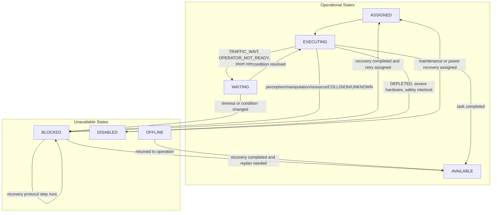

# Humanoid Incident Reference

## 개요

HumanoidSim v0.1은 범용 휴머노이드가 실행 중 겪을 수 있는 **35개 incident**를 정의합니다. Incident는 새로운 state가 아니라 `StateReason + recovery protocol`입니다. 휴머노이드의 현재 상태는 Availability, Mobility, Power, Manipulation 네 축으로 표현하고, 돌발상황의 원인과 후속 대응 절차는 `reason`과 incident profile에 기록합니다.

Incident code는 정의 단계부터 모두 대문자 canonical code를 사용합니다. 예: `GRIP_FAILED`, `ITEM_DROPPED`, `RESOURCE_PREEMPTED`, `UNKNOWN`

## 카테고리별 개수

<table>
  <colgroup>
    <col style="width: 20%;" />
    <col style="width: 21%;" />
    <col style="width: 12%;" />
    <col style="width: 7%;" />
    <col style="width: 40%;" />
  </colgroup>
  <thead>
    <tr>
      <th>Category ID</th>
      <th>Category</th>
      <th>한글명</th>
      <th>개수</th>
      <th>설명</th>
    </tr>
  </thead>
  <tbody>
    <tr>
      <td><code>perception_identification</code></td>
      <td>Perception &amp; Identification</td>
      <td>인식/식별</td>
      <td>4</td>
      <td>대상 탐지, 식별, 자세 추정, marker 판독, target 존재 여부와 관련된 incident입니다.</td>
    </tr>
    <tr>
      <td><code>manipulation_payload</code></td>
      <td>Manipulation &amp; Payload</td>
      <td>조작/적재</td>
      <td>6</td>
      <td>grip, lift, placement, payload 안정성, 운반 중 item 상태와 관련된 incident입니다.</td>
    </tr>
    <tr>
      <td><code>resource_environment</code></td>
      <td>Resource &amp; Environment</td>
      <td>자원/환경</td>
      <td>5</td>
      <td>자원 부재/선점, 막힌 경로, 작업 공간 장애물, 오염 또는 접근 불가 환경과 관련된 incident입니다.</td>
    </tr>
    <tr>
      <td><code>motion_traffic</code></td>
      <td>Motion &amp; Traffic</td>
      <td>이동/교통</td>
      <td>5</td>
      <td>이동, traffic, docking, collision, route execution과 관련된 incident입니다.</td>
    </tr>
    <tr>
      <td><code>power_hardware</code></td>
      <td>Power &amp; Hardware</td>
      <td>전원/하드웨어</td>
      <td>6</td>
      <td>배터리, 전원, sensor, actuator, tool, end-effector와 관련된 incident입니다.</td>
    </tr>
    <tr>
      <td><code>system_communication</code></td>
      <td>System &amp; Communication</td>
      <td>시스템/통신</td>
      <td>4</td>
      <td>네트워크, command timeout, map/context, record 동기화와 관련된 incident입니다.</td>
    </tr>
    <tr>
      <td><code>safety_human_interaction</code></td>
      <td>Safety &amp; Human Interaction</td>
      <td>안전/상호작용</td>
      <td>4</td>
      <td>safety stop, human/robot zone conflict, operator readiness, handover와 관련된 incident입니다.</td>
    </tr>
    <tr>
      <td><code>unknown</code></td>
      <td>Unknown</td>
      <td>원인 미상</td>
      <td>1</td>
      <td>원인을 충분히 특정할 수 없는 incident입니다.</td>
    </tr>
  </tbody>
</table>

총 incident 수: **35개**

## Incident Model

<table>
  <colgroup>
    <col style="width: 24%;" />
    <col style="width: 76%;" />
  </colgroup>
  <thead>
    <tr>
      <th>요소</th>
      <th>설명</th>
    </tr>
  </thead>
  <tbody>
    <tr>
      <td>Incident Code</td>
      <td>incident를 식별하는 안정적인 canonical code입니다. 모든 code는 대문자로 정의합니다.</td>
    </tr>
    <tr>
      <td>Category</td>
      <td>incident를 해석하기 위한 범용 분류입니다. 제조 전용 의미에 묶이지 않습니다.</td>
    </tr>
    <tr>
      <td>Default Availability</td>
      <td>incident 발생 직후 기본 Availability 전이입니다. 대부분 `BLOCKED`, 짧은 재시도 대기는 `WAITING`, 로봇 자체가 작업 불가하면 `DISABLED`입니다.</td>
    </tr>
    <tr>
      <td>Trigger Primitives</td>
      <td>incident가 자연스럽게 발생할 수 있는 primitive입니다. 예: `GRASP` 중 `GRIP_FAILED`</td>
    </tr>
    <tr>
      <td>Aliases</td>
      <td>runtime에서 관찰한 세부 실패 reason을 canonical incident code로 해석하기 위한 별칭입니다.</td>
    </tr>
    <tr>
      <td>Recovery Protocol</td>
      <td>복구, 재시도, 보고, 재작업을 표현하는 step sequence입니다. 모든 step은 기존 task 또는 primitive code를 참조합니다.</td>
    </tr>
    <tr>
      <td>Retry Policy</td>
      <td>local retry 횟수와 지연 시간입니다. 실제 정책 최적화는 runtime 또는 manager layer가 담당합니다.</td>
    </tr>
  </tbody>
</table>

## Incident Codes

<table>
  <colgroup>
    <col style="width: 15%;" />
    <col style="width: 14%;" />
    <col style="width: 31%;" />
    <col style="width: 9%;" />
    <col style="width: 13%;" />
    <col style="width: 18%;" />
  </colgroup>
  <thead>
    <tr>
      <th>Code</th>
      <th>Category</th>
      <th>설명</th>
      <th>Default Availability</th>
      <th>Trigger Primitives</th>
      <th>Recovery Protocol</th>
    </tr>
  </thead>
  <tbody>
    <tr>
      <td><code>OBJECT_RECOGNITION_FAILED</code></td>
      <td>Perception &amp; Identification</td>
      <td>예상한 대상 물체를 인식하지 못한 상황입니다.</td>
      <td><code>BLOCKED</code></td>
      <td><code>LOCALIZE_OBJECT</code>, <code>PRIMITIVE_IDENTIFY_ITEM</code>, <code>IDENTIFY_PRODUCT</code></td>
      <td><code>LOCALIZE_OBJECT</code> -> <code>PRIMITIVE_IDENTIFY_ITEM</code> -> <code>IDENTIFY_ITEM</code> -> <code>CREATE_EXCEPTION_REPORT</code> (optional)</td>
    </tr>
    <tr>
      <td><code>POSE_ESTIMATION_FAILED</code></td>
      <td>Perception &amp; Identification</td>
      <td>대상은 보이지만 자세나 접근 방향을 추정하지 못한 상황입니다.</td>
      <td><code>BLOCKED</code></td>
      <td><code>LOCALIZE_OBJECT</code>, <code>LOCALIZE_COMPONENTS</code>, <code>LOCALIZE_PART</code>, <code>LOCALIZE_SURFACE</code></td>
      <td><code>LOCALIZE_OBJECT</code> -> <code>ALIGN</code> -> <code>CREATE_EXCEPTION_REPORT</code> (optional)</td>
    </tr>
    <tr>
      <td><code>LABEL_OR_MARKER_UNREADABLE</code></td>
      <td>Perception &amp; Identification</td>
      <td>barcode, QR, label, marker, serial, lot 정보 등을 읽지 못한 상황입니다.</td>
      <td><code>BLOCKED</code></td>
      <td><code>PRIMITIVE_IDENTIFY_ITEM</code>, <code>IDENTIFY_PRODUCT</code>, <code>READ_MACHINE_STATE</code></td>
      <td><code>IDENTIFY_ITEM</code> -> <code>CREATE_EXCEPTION_REPORT</code> (optional)</td>
    </tr>
    <tr>
      <td><code>TARGET_NOT_FOUND</code></td>
      <td>Perception &amp; Identification</td>
      <td>계획된 위치에 있어야 할 대상이 현장에 없는 상황입니다.</td>
      <td><code>BLOCKED</code></td>
      <td><code>LOCALIZE_OBJECT</code>, <code>PRIMITIVE_IDENTIFY_ITEM</code></td>
      <td><code>LOCALIZE_OBJECT</code> -> <code>IDENTIFY_ITEM</code> -> <code>CREATE_EXCEPTION_REPORT</code> (optional)</td>
    </tr>
    <tr>
      <td><code>GRIP_FAILED</code></td>
      <td>Manipulation &amp; Payload</td>
      <td>gripper가 item이나 tool을 안정적으로 잡지 못한 상황입니다.</td>
      <td><code>BLOCKED</code></td>
      <td><code>GRASP</code></td>
      <td><code>REACH_TO</code> -> <code>GRASP</code> -> <code>LIFT</code> -> <code>SELF_CHECK</code> (optional) -> <code>RECOVER_FROM_FAULT</code> (optional)</td>
    </tr>
    <tr>
      <td><code>LIFT_FAILED</code></td>
      <td>Manipulation &amp; Payload</td>
      <td>대상을 잡았지만 안전하게 들어 올리지 못한 상황입니다.</td>
      <td><code>BLOCKED</code></td>
      <td><code>LIFT</code></td>
      <td><code>GRASP</code> -> <code>LIFT</code> -> <code>HANDOVER_ITEM</code> (optional) -> <code>RECOVER_FROM_FAULT</code> (optional)</td>
    </tr>
    <tr>
      <td><code>ITEM_DROPPED</code></td>
      <td>Manipulation &amp; Payload</td>
      <td>운반 또는 조작 중 item을 떨어뜨린 상황입니다.</td>
      <td><code>BLOCKED</code></td>
      <td><code>NAVIGATE_TO</code>, <code>PLACE</code>, <code>RELEASE</code></td>
      <td><code>LOCALIZE_OBJECT</code> -> <code>PRIMITIVE_IDENTIFY_ITEM</code> -> <code>TRANSFER</code> -> <code>CREATE_EXCEPTION_REPORT</code> (optional)</td>
    </tr>
    <tr>
      <td><code>ITEM_SLIPPED</code></td>
      <td>Manipulation &amp; Payload</td>
      <td>payload가 완전히 떨어지지는 않았지만 미끄러지거나 불안정해진 상황입니다.</td>
      <td><code>BLOCKED</code></td>
      <td><code>GRASP</code>, <code>LIFT</code>, <code>NAVIGATE_TO</code></td>
      <td><code>REACH_TO</code> -> <code>GRASP</code> -> <code>LIFT</code></td>
    </tr>
    <tr>
      <td><code>PLACEMENT_FAILED</code></td>
      <td>Manipulation &amp; Payload</td>
      <td>목표 위치에 item을 내려놓거나 release하는 데 실패한 상황입니다.</td>
      <td><code>BLOCKED</code></td>
      <td><code>PLACE</code>, <code>RELEASE</code>, <code>VERIFY_PLACEMENT</code></td>
      <td><code>PLACE</code> -> <code>RELEASE</code> -> <code>VERIFY_PLACEMENT</code> -> <code>CREATE_EXCEPTION_REPORT</code> (optional)</td>
    </tr>
    <tr>
      <td><code>PAYLOAD_OVER_LIMIT</code></td>
      <td>Manipulation &amp; Payload</td>
      <td>payload가 휴머노이드의 운반 한계를 초과한 상황입니다.</td>
      <td><code>BLOCKED</code></td>
      <td><code>GRASP</code>, <code>LIFT</code></td>
      <td><code>HANDOVER_ITEM</code> -> <code>TRANSFER</code> (optional)</td>
    </tr>
    <tr>
      <td><code>RESOURCE_PREEMPTED</code></td>
      <td>Resource &amp; Environment</td>
      <td>예상한 resource를 다른 actor가 먼저 가져가거나 점유한 상황입니다.</td>
      <td><code>BLOCKED</code></td>
      <td><code>PRIMITIVE_IDENTIFY_ITEM</code>, <code>LOCALIZE_OBJECT</code>, <code>GRASP</code></td>
      <td><code>PRIMITIVE_IDENTIFY_ITEM</code> -> <code>TRANSFER</code> (optional) -> <code>CREATE_EXCEPTION_REPORT</code> (optional)</td>
    </tr>
    <tr>
      <td><code>RESOURCE_MISSING</code></td>
      <td>Resource &amp; Environment</td>
      <td>필요한 item, tool, vehicle, equipment 또는 consumable이 없는 상황입니다.</td>
      <td><code>BLOCKED</code></td>
      <td><code>CHECK_REQUEST</code>, <code>PRIMITIVE_IDENTIFY_ITEM</code>, <code>LOCALIZE_OBJECT</code></td>
      <td><code>CHECK_REQUEST</code> -> <code>REPLENISH_MATERIAL</code> (optional) -> <code>CREATE_EXCEPTION_REPORT</code> (optional)</td>
    </tr>
    <tr>
      <td><code>PATH_BLOCKED</code></td>
      <td>Resource &amp; Environment</td>
      <td>계획된 route를 따라 이동할 수 없을 만큼 경로가 막힌 상황입니다.</td>
      <td><code>BLOCKED</code></td>
      <td><code>NAVIGATE_TO</code></td>
      <td><code>NAVIGATE_TO</code> -> <code>REPORT_HAZARD</code> (optional)</td>
    </tr>
    <tr>
      <td><code>WORKSPACE_OBSTRUCTED</code></td>
      <td>Resource &amp; Environment</td>
      <td>작업 공간이나 service tile이 막혀 task를 진행할 수 없는 상황입니다.</td>
      <td><code>BLOCKED</code></td>
      <td><code>CHECK_SAFETY_ZONE</code>, <code>REACH_TO</code>, <code>ALIGN</code></td>
      <td><code>CLEAN_AREA</code> (optional) -> <code>REPORT_HAZARD</code> (optional)</td>
    </tr>
    <tr>
      <td><code>SURFACE_OR_AREA_CONTAMINATED</code></td>
      <td>Resource &amp; Environment</td>
      <td>바닥, 표면, 작업대 또는 공유 구역이 오염되었거나 안전하지 않은 상황입니다.</td>
      <td><code>BLOCKED</code></td>
      <td><code>CHECK_SAFETY_ZONE</code>, <code>INSPECT_AREA</code></td>
      <td><code>CLEAN_AREA</code> -> <code>REPORT_HAZARD</code> (optional)</td>
    </tr>
    <tr>
      <td><code>TRAFFIC_WAIT</code></td>
      <td>Motion &amp; Traffic</td>
      <td>traffic policy 또는 reservation 때문에 이동을 잠시 기다리는 상황입니다.</td>
      <td><code>WAITING</code></td>
      <td><code>NAVIGATE_TO</code></td>
      <td><code>NAVIGATE_TO</code></td>
    </tr>
    <tr>
      <td><code>NEAR_MISS</code></td>
      <td>Motion &amp; Traffic</td>
      <td>충돌에 가까운 tile 또는 edge 접근이 감지된 상황입니다.</td>
      <td><code>BLOCKED</code></td>
      <td><code>NAVIGATE_TO</code></td>
      <td><code>NAVIGATE_TO</code> -> <code>REPORT_HAZARD</code> (optional)</td>
    </tr>
    <tr>
      <td><code>COLLISION</code></td>
      <td>Motion &amp; Traffic</td>
      <td>tile 또는 edge 수준에서 실제 collision이 감지된 상황입니다.</td>
      <td><code>BLOCKED</code></td>
      <td><code>NAVIGATE_TO</code></td>
      <td><code>REPORT_HAZARD</code> -> <code>SELF_CHECK</code> (optional)</td>
    </tr>
    <tr>
      <td><code>NAVIGATION_DRIFT</code></td>
      <td>Motion &amp; Traffic</td>
      <td>실제 위치가 계획된 route나 예상 tile과 어긋난 상황입니다.</td>
      <td><code>BLOCKED</code></td>
      <td><code>NAVIGATE_TO</code></td>
      <td><code>LOAD_WORK_CONTEXT</code> -> <code>NAVIGATE_TO</code></td>
    </tr>
    <tr>
      <td><code>DOCKING_FAILED</code></td>
      <td>Motion &amp; Traffic</td>
      <td>충전기, 작업대, 설비 등 docking target에 정렬하지 못한 상황입니다.</td>
      <td><code>BLOCKED</code></td>
      <td><code>ALIGN</code></td>
      <td><code>ALIGN</code> -> <code>NAVIGATE_TO</code></td>
    </tr>
    <tr>
      <td><code>POWER_LOW_UNEXPECTED</code></td>
      <td>Power &amp; Hardware</td>
      <td>현재 계획보다 빠르게 배터리가 낮아진 상황입니다.</td>
      <td><code>BLOCKED</code></td>
      <td><code>EXECUTE_SYSTEM_ACTION</code>, <code>NAVIGATE_TO</code></td>
      <td><code>MANAGE_ROBOT_POWER</code></td>
    </tr>
    <tr>
      <td><code>POWER_INTERRUPTION</code></td>
      <td>Power &amp; Hardware</td>
      <td>전원 순간 장애로 안전한 task 실행이 어려운 상황입니다.</td>
      <td><code>DISABLED</code></td>
      <td><code>EXECUTE_SYSTEM_ACTION</code>, <code>NAVIGATE_TO</code></td>
      <td><code>MANAGE_ROBOT_POWER</code> -> <code>RECOVER_FROM_FAULT</code> (optional)</td>
    </tr>
    <tr>
      <td><code>DEPLETED</code></td>
      <td>Power &amp; Hardware</td>
      <td>배터리가 방전된 상황입니다.</td>
      <td><code>DISABLED</code></td>
      <td><code>NAVIGATE_TO</code>, <code>EXECUTE_SYSTEM_ACTION</code></td>
      <td><code>MANAGE_ROBOT_POWER</code></td>
    </tr>
    <tr>
      <td><code>SENSOR_DEGRADED</code></td>
      <td>Power &amp; Hardware</td>
      <td>sensor 성능 저하로 task 신뢰도가 낮아진 상황입니다.</td>
      <td><code>BLOCKED</code></td>
      <td><code>LOCALIZE_OBJECT</code>, <code>READ_MACHINE_STATE</code></td>
      <td><code>SELF_CHECK</code> -> <code>RECOVER_FROM_FAULT</code> (optional)</td>
    </tr>
    <tr>
      <td><code>TOOL_OR_END_EFFECTOR_FAULT</code></td>
      <td>Power &amp; Hardware</td>
      <td>tool 또는 end-effector 이상으로 안전한 manipulation이 어려운 상황입니다.</td>
      <td><code>DISABLED</code></td>
      <td><code>GRASP</code>, <code>LIFT</code>, <code>PLACE</code>, <code>RELEASE</code></td>
      <td><code>CHANGE_END_EFFECTOR</code> -> <code>RECOVER_FROM_FAULT</code></td>
    </tr>
    <tr>
      <td><code>ACTUATOR_FAULT</code></td>
      <td>Power &amp; Hardware</td>
      <td>joint 또는 actuator 이상으로 motion/manipulation이 어려운 상황입니다.</td>
      <td><code>DISABLED</code></td>
      <td><code>NAVIGATE_TO</code>, <code>REACH_TO</code>, <code>GRASP</code>, <code>LIFT</code></td>
      <td><code>SELF_CHECK</code> -> <code>RECOVER_FROM_FAULT</code></td>
    </tr>
    <tr>
      <td><code>COMMUNICATION_LOST</code></td>
      <td>System &amp; Communication</td>
      <td>controller 또는 외부 시스템과 통신이 일시적으로 끊긴 상황입니다.</td>
      <td><code>WAITING</code></td>
      <td><code>CREATE_OR_UPDATE_RECORD</code>, <code>READ_MACHINE_STATE</code>, <code>EXECUTE_SYSTEM_ACTION</code></td>
      <td><code>LOAD_WORK_CONTEXT</code> -> <code>CREATE_EXCEPTION_REPORT</code> (optional)</td>
    </tr>
    <tr>
      <td><code>COMMAND_TIMEOUT</code></td>
      <td>System &amp; Communication</td>
      <td>명령이나 외부 operation이 제한 시간 안에 응답하지 않은 상황입니다.</td>
      <td><code>BLOCKED</code></td>
      <td><code>EXECUTE_SYSTEM_ACTION</code>, <code>EXECUTE_MACHINE_ACTION</code>, <code>CREATE_OR_UPDATE_RECORD</code></td>
      <td><code>CHECK_CONTEXT</code> -> <code>CREATE_EXCEPTION_REPORT</code> (optional)</td>
    </tr>
    <tr>
      <td><code>MAP_OR_CONTEXT_STALE</code></td>
      <td>System &amp; Communication</td>
      <td>활성 map, work context, task context가 오래되어 신뢰할 수 없는 상황입니다.</td>
      <td><code>BLOCKED</code></td>
      <td><code>CHECK_CONTEXT</code>, <code>NAVIGATE_TO</code></td>
      <td><code>LOAD_WORK_CONTEXT</code> -> <code>CHECK_CONTEXT</code></td>
    </tr>
    <tr>
      <td><code>RECORD_UPDATE_FAILED</code></td>
      <td>System &amp; Communication</td>
      <td>MES, WMS, log, evidence record 갱신에 실패한 상황입니다.</td>
      <td><code>BLOCKED</code></td>
      <td><code>LOG_RESULT</code>, <code>UPDATE_RECORD</code>, <code>CREATE_OR_UPDATE_RECORD</code>, <code>RECORD_RESULT</code></td>
      <td><code>CREATE_OR_UPDATE_RECORD</code> -> <code>CREATE_EXCEPTION_REPORT</code> (optional)</td>
    </tr>
    <tr>
      <td><code>SAFETY_STOP</code></td>
      <td>Safety &amp; Human Interaction</td>
      <td>safety stop 또는 interlock이 발생해 운용이 멈춘 상황입니다.</td>
      <td><code>DISABLED</code></td>
      <td><code>CHECK_SAFETY_ZONE</code>, <code>NAVIGATE_TO</code>, <code>EXECUTE_MACHINE_ACTION</code></td>
      <td><code>REPORT_HAZARD</code> -> <code>SELF_CHECK</code> (optional)</td>
    </tr>
    <tr>
      <td><code>HUMAN_IN_WORK_ZONE</code></td>
      <td>Safety &amp; Human Interaction</td>
      <td>사람이나 다른 actor가 active work zone에 들어온 상황입니다.</td>
      <td><code>WAITING</code></td>
      <td><code>CHECK_SAFETY_ZONE</code>, <code>NAVIGATE_TO</code>, <code>REACH_TO</code></td>
      <td><code>CHECK_SAFETY_ZONE</code> -> <code>ANNOUNCE_INTENT</code> -> <code>REPORT_HAZARD</code> (optional)</td>
    </tr>
    <tr>
      <td><code>HANDOVER_FAILED</code></td>
      <td>Safety &amp; Human Interaction</td>
      <td>human/robot 또는 robot/robot handover를 안전하게 완료하지 못한 상황입니다.</td>
      <td><code>BLOCKED</code></td>
      <td><code>ANNOUNCE_INTENT</code>, <code>CONFIRM_OPERATOR_STATE</code>, <code>EXECUTE_HUMAN_COLLABORATION_ACTION</code></td>
      <td><code>ANNOUNCE_INTENT</code> -> <code>CONFIRM_OPERATOR_STATE</code> -> <code>HANDOVER_ITEM</code></td>
    </tr>
    <tr>
      <td><code>OPERATOR_NOT_READY</code></td>
      <td>Safety &amp; Human Interaction</td>
      <td>operator 또는 협업 actor가 다음 interaction을 수행할 준비가 되지 않은 상황입니다.</td>
      <td><code>WAITING</code></td>
      <td><code>CONFIRM_OPERATOR_STATE</code>, <code>ANNOUNCE_INTENT</code></td>
      <td><code>CONFIRM_OPERATOR_STATE</code> -> <code>ANNOUNCE_INTENT</code></td>
    </tr>
    <tr>
      <td><code>UNKNOWN</code></td>
      <td>Unknown</td>
      <td>원인을 충분히 특정할 수 없는 예외적 중단 상황입니다.</td>
      <td><code>BLOCKED</code></td>
      <td>all primitives</td>
      <td><code>SELF_CHECK</code> -> <code>CREATE_EXCEPTION_REPORT</code> -> <code>RECOVER_FROM_FAULT</code> (optional)</td>
    </tr>
  </tbody>
</table>

## Alias Resolution

Incident의 canonical code는 HumanoidSim이 소유합니다. ManSim 같은 runtime은 scenario에서 관찰한 세부 reason 문자열을 전달할 수 있고, HumanoidSim은 `IncidentProfile.aliases`를 통해 이를 canonical incident로 해석합니다.

<table>
  <colgroup>
    <col style="width: 25%;" />
    <col style="width: 25%;" />
    <col style="width: 50%;" />
  </colgroup>
  <thead>
    <tr>
      <th>Alias</th>
      <th>Canonical Incident</th>
      <th>의미</th>
    </tr>
  </thead>
  <tbody>
    <tr>
      <td><code>material_carry_failed</code></td>
      <td><code>GRIP_FAILED</code></td>
      <td>gripper가 item이나 tool을 안정적으로 잡지 못한 상황입니다.</td>
    </tr>
    <tr>
      <td><code>material_supply_owner_changed</code></td>
      <td><code>RESOURCE_PREEMPTED</code></td>
      <td>예상한 resource를 다른 actor가 먼저 가져가거나 점유한 상황입니다.</td>
    </tr>
    <tr>
      <td><code>material_shelf_slot_empty</code></td>
      <td><code>RESOURCE_PREEMPTED</code></td>
      <td>예상한 resource를 다른 actor가 먼저 가져가거나 점유한 상황입니다.</td>
    </tr>
    <tr>
      <td><code>stale_precondition</code></td>
      <td><code>RESOURCE_PREEMPTED</code></td>
      <td>예상한 resource를 다른 actor가 먼저 가져가거나 점유한 상황입니다.</td>
    </tr>
    <tr>
      <td><code>material_shelf_empty</code></td>
      <td><code>RESOURCE_MISSING</code></td>
      <td>필요한 item, tool, vehicle, equipment 또는 consumable이 없는 상황입니다.</td>
    </tr>
    <tr>
      <td><code>precondition_failed</code></td>
      <td><code>RESOURCE_MISSING</code></td>
      <td>필요한 item, tool, vehicle, equipment 또는 consumable이 없는 상황입니다.</td>
    </tr>
    <tr>
      <td><code>material_shelf_pickup_unreachable</code></td>
      <td><code>PATH_BLOCKED</code></td>
      <td>계획된 route를 따라 이동할 수 없을 만큼 경로가 막힌 상황입니다.</td>
    </tr>
    <tr>
      <td><code>material_supply_dropoff_unreachable</code></td>
      <td><code>PATH_BLOCKED</code></td>
      <td>계획된 route를 따라 이동할 수 없을 만큼 경로가 막힌 상황입니다.</td>
    </tr>
  </tbody>
</table>

## Recovery Protocol 검증

Recovery protocol의 각 step은 `kind=primitive` 또는 `kind=task`를 갖습니다.

- `kind=primitive`이면 `code`가 HumanoidSim primitive registry에 존재해야 합니다.
- `kind=task`이면 `code`가 HumanoidSim task catalog에 존재해야 합니다.
- 존재하지 않는 primitive/task를 참조하면 `validate_incident_schema()`가 실패합니다.

현재 v0.1 schema 기준 recovery step은 총 86개이며, 모두 정의된 primitive 또는 task를 참조합니다.

Recovery protocol은 incident로 인해 막힌 상태를 해소하기 위한 절차입니다. 따라서 recovery step이 task 또는 primitive를 실행하더라도 Availability는 정상 작업의 `EXECUTING`으로 바꾸지 않고 `BLOCKED`를 유지합니다. 현재 수행 중인 recovery step은 `task_context.task_code` 또는 `task_context.primitive_call_code`에 기록하고, UI나 replay에서는 `CODE (RECOVERY)`처럼 일반 작업과 구분해서 표시합니다. Recovery protocol이 끝나면 runtime은 task 취소, 재할당, 재시도 같은 후속 정책에 따라 `AVAILABLE`, `ASSIGNED`, 또는 계속 `BLOCKED` 중 하나로 전이시킬 수 있습니다.

## State Transition

Incident는 주로 Availability 축에 영향을 줍니다. Mobility, Manipulation, Power는 incident 순간의 물리 상태를 유지하거나 power/hardware incident처럼 명확한 경우에만 함께 바뀝니다.



## Runtime 사용 예시

```python
from humanoidsim import build_incident_transition_event, transition_humanoid_state

event = build_incident_transition_event(
    "GRIP_FAILED",
    task_code="TRANSFER",
    primitive_call_code="GRASP",
)
next_snapshot = transition_humanoid_state(current_snapshot, event)
```

Alias도 같은 API로 해석됩니다.

```python
event = build_incident_transition_event("material_shelf_slot_empty")
assert event.reason.code == "RESOURCE_PREEMPTED"
```

ManSim 같은 runtime은 incident 발생 확률과 발생 조건만 판단합니다. Incident code, alias resolution, 기본 state transition, recovery protocol의 의미는 HumanoidSim 정의를 사용합니다.
