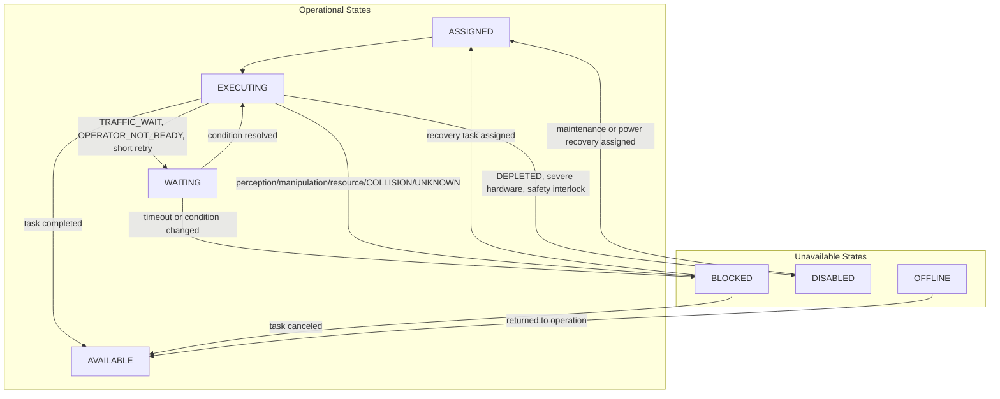

# Humanoid Incident Reference

## 개요

HumanoidSim v0.1은 범용 휴머노이드가 실행 중 겪을 수 있는 **35개 incident**를 정의합니다. Incident는 새로운 state가 아니라 `StateReason + recovery protocol`입니다. 즉, 휴머노이드의 현재 상태는 기존 네 축인 Availability, Mobility, Power, Manipulation으로 표현하고, 돌발상황의 원인과 후속 대응 절차는 `reason`에 기록합니다.

Incident code는 정의 단계부터 모두 대문자 canonical code를 사용합니다. 예: `GRIP_FAILED`, `ITEM_DROPPED`, `RESOURCE_PREEMPTED`, `UNKNOWN`

## 카테고리별 개수

| Category ID | Category | Count | 설명 |
| --- | --- | ---: | --- |
| `perception_identification` | Perception & Identification | 4 | 물체 인식, 자세 추정, 라벨/마커 판독, 대상 존재 확인 관련 incident |
| `manipulation_payload` | Manipulation & Payload | 6 | 잡기, 들기, 운반, 배치, payload 한계 관련 incident |
| `resource_environment` | Resource & Environment | 5 | 자원 선점, 자원 부재, 경로/작업공간/표면 조건 관련 incident |
| `motion_traffic` | Motion & Traffic | 5 | 이동 대기, near miss, 충돌, 위치 drift, docking 실패 관련 incident |
| `power_hardware` | Power & Hardware | 6 | 전원, 배터리, 센서, end-effector, actuator 관련 incident |
| `system_communication` | System & Communication | 4 | 통신, 명령 timeout, map/context, record update 관련 incident |
| `safety_human_interaction` | Safety & Human Interaction | 4 | safety stop, 작업 구역 진입, handover, operator readiness 관련 incident |
| `unknown` | Unknown | 1 | 원인을 특정할 수 없는 incident |

총 incident 수: **35개**

## Incident Model

| 요소 | 설명 |
| --- | --- |
| Incident Code | incident를 식별하는 안정적인 code입니다. Code는 canonical uppercase로 정의합니다. |
| Category | incident를 해석하기 위한 범용 분류입니다. 제조 전용 의미에 묶이지 않습니다. |
| Default Availability | incident 발생 직후 기본 Availability 전이입니다. 대부분 `BLOCKED`, 짧은 대기는 `WAITING`, 로봇 자체가 작업 불가이면 `DISABLED`입니다. |
| Trigger Primitives | incident가 자연스럽게 발생할 수 있는 primitive입니다. 예: `GRASP` 중 `GRIP_FAILED` |
| Recovery Protocol | 기존 task 또는 primitive만 사용해 복구, 재시도, 보고, 재작업을 표현하는 순서입니다. |
| Retry Policy | local retry 횟수와 지연 시간입니다. 실제 정책 최적화는 runtime 또는 manager layer가 담당합니다. |

## Incident Codes

| Code | Category | Default Availability | Trigger Primitives | Recovery Protocol |
| --- | --- | --- | --- | --- |
| `OBJECT_RECOGNITION_FAILED` | Perception & Identification | `BLOCKED` | `LOCALIZE_OBJECT`, `PRIMITIVE_IDENTIFY_ITEM`, `IDENTIFY_PRODUCT` | `LOCALIZE_OBJECT` -> `PRIMITIVE_IDENTIFY_ITEM` -> `IDENTIFY_ITEM` -> `CREATE_EXCEPTION_REPORT` |
| `POSE_ESTIMATION_FAILED` | Perception & Identification | `BLOCKED` | `LOCALIZE_OBJECT`, `LOCALIZE_COMPONENTS`, `LOCALIZE_PART`, `LOCALIZE_SURFACE` | `LOCALIZE_OBJECT` -> `ALIGN` -> `REACH_TO` -> `CREATE_EXCEPTION_REPORT` |
| `LABEL_OR_MARKER_UNREADABLE` | Perception & Identification | `BLOCKED` | `READ_MACHINE_STATE`, `PRIMITIVE_IDENTIFY_ITEM`, `SCAN_CODE`, `READ_LABEL` | `PRIMITIVE_IDENTIFY_ITEM` -> `LOAD_WORK_CONTEXT` -> `CREATE_EXCEPTION_REPORT` |
| `TARGET_NOT_FOUND` | Perception & Identification | `BLOCKED` | `LOCALIZE_OBJECT`, `NAVIGATE_TO` | `LOCALIZE_OBJECT` -> `IDENTIFY_ITEM` -> `CREATE_EXCEPTION_REPORT` |
| `GRIP_FAILED` | Manipulation & Payload | `BLOCKED` | `GRASP`, `REACH_TO` | `REACH_TO` -> `GRASP` -> `LIFT` -> `CREATE_EXCEPTION_REPORT` |
| `LIFT_FAILED` | Manipulation & Payload | `BLOCKED` | `LIFT` | `GRASP` -> `LIFT` -> `HANDOVER_ITEM` -> `RECOVER_FROM_FAULT` |
| `ITEM_DROPPED` | Manipulation & Payload | `BLOCKED` | `NAVIGATE_TO`, `TRANSFER` | `LOCALIZE_OBJECT` -> `GRASP` -> `TRANSFER` -> `CREATE_EXCEPTION_REPORT` |
| `ITEM_SLIPPED` | Manipulation & Payload | `BLOCKED` | `NAVIGATE_TO`, `LIFT` | `GRASP` -> `LIFT` -> `TRANSFER` -> `CREATE_EXCEPTION_REPORT` |
| `PLACEMENT_FAILED` | Manipulation & Payload | `BLOCKED` | `PLACE`, `RELEASE` | `ALIGN` -> `PLACE` -> `RELEASE` -> `CREATE_EXCEPTION_REPORT` |
| `PAYLOAD_OVER_LIMIT` | Manipulation & Payload | `BLOCKED` | `LIFT`, `TRANSFER` | `HANDOVER_ITEM` -> `RECOVER_FROM_FAULT` -> `CREATE_EXCEPTION_REPORT` |
| `RESOURCE_PREEMPTED` | Resource & Environment | `BLOCKED` | `CHECK_REQUEST`, `PRIMITIVE_IDENTIFY_ITEM` | `LOAD_WORK_CONTEXT` -> `PRIMITIVE_IDENTIFY_ITEM` -> `CREATE_EXCEPTION_REPORT` |
| `RESOURCE_MISSING` | Resource & Environment | `BLOCKED` | `CHECK_REQUEST`, `LOCALIZE_OBJECT` | `LOAD_WORK_CONTEXT` -> `CREATE_EXCEPTION_REPORT` |
| `PATH_BLOCKED` | Resource & Environment | `BLOCKED` | `NAVIGATE_TO` | `NAVIGATE_TO` -> `CREATE_EXCEPTION_REPORT` |
| `WORKSPACE_OBSTRUCTED` | Resource & Environment | `BLOCKED` | `CHECK_SAFETY_ZONE`, `REACH_TO` | `CHECK_SAFETY_ZONE` -> `CLEAN_AREA` -> `REPORT_HAZARD` |
| `SURFACE_OR_AREA_CONTAMINATED` | Resource & Environment | `BLOCKED` | `CHECK_SAFETY_ZONE`, `INSPECT_AREA` | `INSPECT_AREA` -> `CLEAN_AREA` -> `REPORT_HAZARD` |
| `TRAFFIC_WAIT` | Motion & Traffic | `WAITING` | `NAVIGATE_TO` | `NAVIGATE_TO` |
| `NEAR_MISS` | Motion & Traffic | `BLOCKED` | `NAVIGATE_TO` | `CHECK_SAFETY_ZONE` -> `NAVIGATE_TO` -> `REPORT_HAZARD` |
| `COLLISION` | Motion & Traffic | `BLOCKED` | `NAVIGATE_TO` | `CHECK_SAFETY_ZONE` -> `RECOVER_FROM_FAULT` -> `REPORT_HAZARD` |
| `NAVIGATION_DRIFT` | Motion & Traffic | `BLOCKED` | `NAVIGATE_TO`, `ALIGN` | `LOCALIZE_OBJECT` -> `NAVIGATE_TO` -> `CREATE_EXCEPTION_REPORT` |
| `DOCKING_FAILED` | Motion & Traffic | `BLOCKED` | `ALIGN`, `DOCKING` | `ALIGN` -> `MANAGE_ROBOT_POWER` -> `CREATE_EXCEPTION_REPORT` |
| `POWER_LOW_UNEXPECTED` | Power & Hardware | `BLOCKED` | `VERIFY_ROBOT_STATE`, `NAVIGATE_TO` | `VERIFY_ROBOT_STATE` -> `MANAGE_ROBOT_POWER` |
| `POWER_INTERRUPTION` | Power & Hardware | `DISABLED` | `VERIFY_ROBOT_STATE` | `SELF_CHECK` -> `MANAGE_ROBOT_POWER` -> `RECOVER_FROM_FAULT` |
| `DEPLETED` | Power & Hardware | `DISABLED` | `VERIFY_ROBOT_STATE`, `EXECUTE_SYSTEM_ACTION` | `MANAGE_ROBOT_POWER` -> `RECOVER_FROM_FAULT` |
| `SENSOR_DEGRADED` | Power & Hardware | `BLOCKED` | `LOCALIZE_OBJECT`, `READ_MACHINE_STATE` | `SELF_CHECK` -> `LOCALIZE_OBJECT` -> `CREATE_EXCEPTION_REPORT` |
| `TOOL_OR_END_EFFECTOR_FAULT` | Power & Hardware | `DISABLED` | `GRASP`, `LIFT`, `PLACE` | `SELF_CHECK` -> `CHANGE_END_EFFECTOR` -> `RECOVER_FROM_FAULT` |
| `ACTUATOR_FAULT` | Power & Hardware | `DISABLED` | `NAVIGATE_TO`, `REACH_TO`, `LIFT` | `SELF_CHECK` -> `RECOVER_FROM_FAULT` -> `CREATE_EXCEPTION_REPORT` |
| `COMMUNICATION_LOST` | System & Communication | `WAITING` | `LOAD_WORK_CONTEXT`, `CREATE_OR_UPDATE_RECORD` | `LOAD_WORK_CONTEXT` -> `CREATE_EXCEPTION_REPORT` |
| `COMMAND_TIMEOUT` | System & Communication | `BLOCKED` | `EXECUTE_SYSTEM_ACTION`, `CREATE_OR_UPDATE_RECORD` | `LOAD_WORK_CONTEXT` -> `CREATE_EXCEPTION_REPORT` |
| `MAP_OR_CONTEXT_STALE` | System & Communication | `BLOCKED` | `LOAD_WORK_CONTEXT`, `NAVIGATE_TO` | `LOAD_WORK_CONTEXT` -> `NAVIGATE_TO` |
| `RECORD_UPDATE_FAILED` | System & Communication | `WAITING` | `UPDATE_RECORD`, `CREATE_OR_UPDATE_RECORD`, `RECORD_RESULT` | `CREATE_OR_UPDATE_RECORD` -> `CREATE_EXCEPTION_REPORT` |
| `SAFETY_STOP` | Safety & Human Interaction | `DISABLED` | `CHECK_SAFETY_ZONE`, `NAVIGATE_TO` | `CHECK_SAFETY_ZONE` -> `REPORT_HAZARD` -> `RECOVER_FROM_FAULT` |
| `HUMAN_IN_WORK_ZONE` | Safety & Human Interaction | `WAITING` | `CHECK_SAFETY_ZONE`, `ANNOUNCE_INTENT` | `ANNOUNCE_INTENT` -> `CONFIRM_OPERATOR_STATE` -> `CHECK_SAFETY_ZONE` |
| `HANDOVER_FAILED` | Safety & Human Interaction | `BLOCKED` | `HANDOVER_ITEM`, `CONFIRM_OPERATOR_STATE` | `ANNOUNCE_INTENT` -> `CONFIRM_OPERATOR_STATE` -> `HANDOVER_ITEM` |
| `OPERATOR_NOT_READY` | Safety & Human Interaction | `WAITING` | `CONFIRM_OPERATOR_STATE`, `ANNOUNCE_INTENT` | `ANNOUNCE_INTENT` -> `CONFIRM_OPERATOR_STATE` |
| `UNKNOWN` | Unknown | `BLOCKED` | all primitives | `SELF_CHECK` -> `CREATE_EXCEPTION_REPORT` -> `RECOVER_FROM_FAULT` |

## Recovery Protocol 검증

Recovery protocol의 각 step은 `kind=primitive` 또는 `kind=task`를 갖습니다.

- `kind=primitive`이면 `code`가 HumanoidSim primitive registry에 존재해야 합니다.
- `kind=task`이면 `code`가 HumanoidSim task catalog에 존재해야 합니다.
- 존재하지 않는 primitive/task를 참조하면 `validate_incident_schema()`가 실패합니다.

현재 v0.1 schema 기준 recovery step은 총 86개이며, 모두 정의된 primitive 또는 task를 참조합니다.

## State Transition

Incident는 주로 Availability 축에 영향을 줍니다. Mobility, Manipulation, Power는 incident 순간의 물리 상태를 유지하거나, power/hardware incident처럼 명확한 경우에만 함께 바뀝니다.



## Runtime 사용 예시

```python
from humanoidsim import build_incident_transition_event, transition_humanoid_state

event = build_incident_transition_event(
    "GRIP_FAILED",
    task_code="TRANSFER",
    task_instance_id="task-001",
    primitive_call_code="GRASP",
)
next_snapshot = transition_humanoid_state(current_snapshot, event)
```

ManSim 같은 runtime은 incident 발생 확률과 발생 조건만 판단합니다. Incident code, 기본 state transition, recovery protocol의 의미는 HumanoidSim 정의를 사용합니다.
