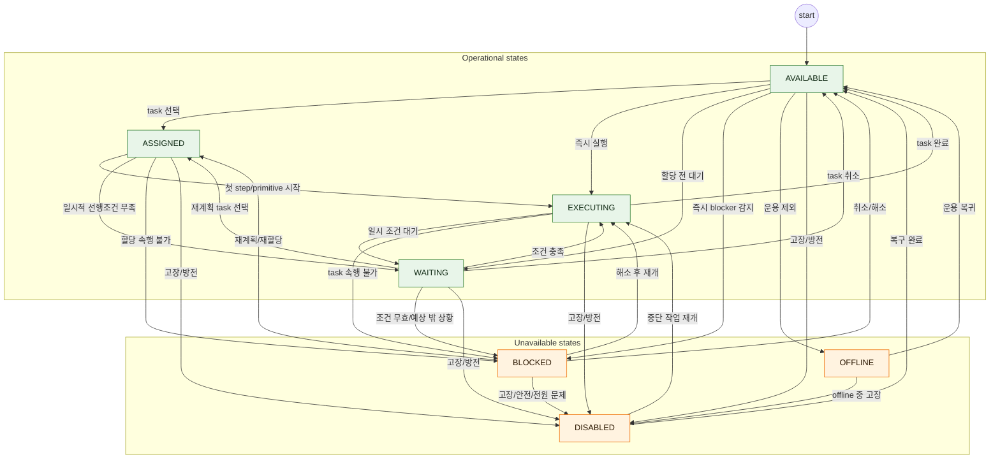
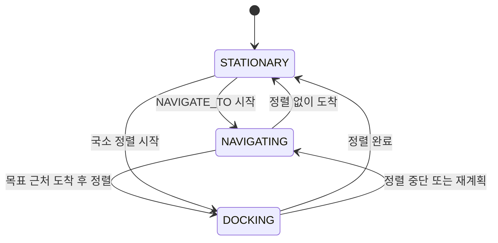
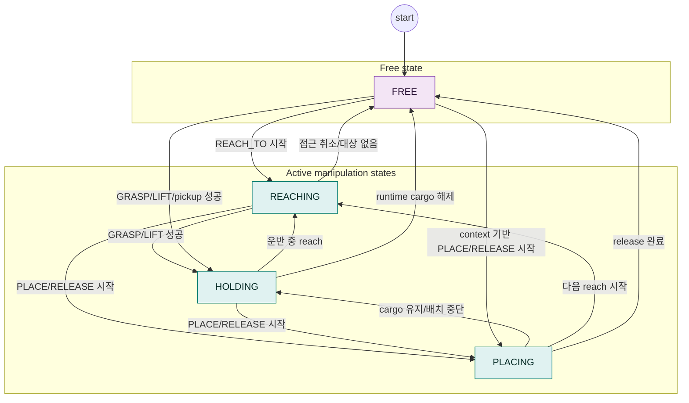

# State Reference

이 문서는 HumanoidSim v0.1의 휴머노이드 상태 모델을 정리한 reference입니다. State는 휴머노이드가 "무슨 일을 하는지"가 아니라, 특정 시점에 "어떤 운용 상태인지"를 표현합니다. Task와 Primitive는 작업 구조를 정의하고, State는 그 작업을 수행하는 동안의 현재 상태를 네 개 축으로 기록합니다.

## 요약

- 원본 코드 정의: `src/humanoidsim/state_schema.py`
- 원본 JSON schema: `data/state_schema_core.json`
- Snapshot 타입: `HumanoidStateSnapshot`
- 상태 축 수: 4개
- Availability 상태 수: 7개
- Mobility 상태 수: 3개
- Power 상태 수: 5개
- Manipulation 상태 수: 4개
- 기본 상태: `AVAILABLE / STATIONARY / POWER_NORMAL / FREE`

## Task, Primitive, State 관계

| 개념 | 의미 | 예시 | State와의 관계 |
| --- | --- | --- | --- |
| Task | 휴머노이드가 달성해야 하는 목표 작업입니다. | `TRANSFER`, `INSPECT_PRODUCT`, `REPAIR_MACHINE` | `task_context.task_code`에 기록합니다. Task 자체를 state로 만들지 않습니다. |
| Primitive | Task를 이루는 가장 작은 실행 단계입니다. | `NAVIGATE_TO`, `GRASP`, `PLACE` | `task_context.primitive_call_code`에 기록하고, 일부 primitive는 state 축을 바꾸는 hint를 제공합니다. |
| State | 휴머노이드의 현재 운용 상태입니다. | `availability=EXECUTING`, `mobility=NAVIGATING` | 네 축의 조합으로 표현합니다. 하나의 task 수행 중에도 primitive에 따라 state가 바뀔 수 있습니다. |

예를 들어 `TRANSFER` task를 수행하는 동안 휴머노이드가 이동 중이면 `availability=EXECUTING`, `mobility=NAVIGATING`, `manipulation=HOLDING`처럼 여러 축이 동시에 의미를 가집니다.


## 코드 기반 Transition API

HumanoidSim은 state transition을 코드와 `data/state_schema_core.json`에서 함께 정의합니다.

| API | 목적 |
| --- | --- |
| `get_primitive_state_profile(call_code)` | primitive의 실행 중 availability, 허용 state, 시작/종료 effect를 읽습니다. |
| `validate_primitive_state_profile(profile)` | primitive profile이 core state schema에 정의된 state만 사용하는지 검증합니다. |
| `transition_humanoid_state(snapshot, event)` | task, primitive, cargo, power, waiting, blocked, disabled event를 기반으로 다음 `HumanoidStateSnapshot`을 계산합니다. |
| `validate_state_transition(previous, next, event)` | 이전 snapshot에서 다음 snapshot으로의 축별 전이가 schema transition graph에서 허용되는지 검증합니다. |

`StateTransitionEvent`는 ManSim 같은 runtime이 HumanoidSim에 전달하는 event 계약입니다. 대표 event type은 `task_assigned`, `task_started`, `primitive_started`, `primitive_finished`, `task_completed`, `waiting`, `blocked`, `disabled`, `cargo_changed`입니다. Runtime은 어떤 일이 발생했는지만 보고하고, HumanoidSim은 그 event를 기반으로 state 축을 계산합니다.

Primitive profile은 `Allowed+Effects` 구조를 사용합니다.

```json
{
  "availability": { "running": "EXECUTING" },
  "allowed": {
    "mobility": ["NAVIGATING", "STATIONARY"],
    "manipulation": ["FREE", "HOLDING"],
    "power": ["POWER_NORMAL", "POWER_LOW", "POWER_CRITICAL", "DEPLETED", "CHARGING"]
  },
  "effects": {
    "on_start": { "mobility": "NAVIGATING" },
    "on_end": { "mobility": "STATIONARY" }
  }
}
```

예를 들어 `NAVIGATE_TO`는 시작 시 `mobility=NAVIGATING`, 종료 시 `mobility=STATIONARY`를 적용합니다. `GRASP`와 `LIFT`는 `manipulation=HOLDING`을 적용하고, `PLACE`와 `RELEASE`는 시작 시 `manipulation=PLACING`, 종료 시 `manipulation=FREE`를 적용합니다. 기록과 확인 계열 primitive는 보통 manipulation을 직접 바꾸지 않고, 현재 cargo 관련 manipulation state가 계속 유효하도록 허용합니다.

## Snapshot Schema

`HumanoidStateSnapshot`은 runtime이 관찰하거나 저장해야 하는 표준 상태 payload입니다.

| 필드 | 타입 | 필수 여부 | 설명 |
| --- | --- | --- | --- |
| `humanoid_id` | `str` | Yes | 상태가 속한 휴머노이드 ID입니다. |
| `availability` | `AvailabilityState` | Yes | 일을 받을 수 있는지, task lifecycle에서 어디에 있는지 나타냅니다. |
| `mobility` | `MobilityState` | Yes | 이동 관점의 현재 상태입니다. |
| `power` | `PowerState` | Yes | 배터리와 전원 상태입니다. |
| `manipulation` | `ManipulationState` | Yes | 팔, 그리퍼, 적재 상태입니다. |
| `task_context` | `TaskContext | null` | No | 현재 task, step, primitive 정보를 연결합니다. |
| `reason` | `StateReason | null` | Conditional | `WAITING`, `BLOCKED`, `DISABLED` 같은 상태의 원인을 기록합니다. |
| `timestamp_s` | `float | null` | No | snapshot 생성 시각입니다. 단위는 초입니다. |
| `metadata` | `dict` | No | runtime별 보조 정보입니다. ManSim에서는 battery, source, task id 등을 넣을 수 있습니다. |

### 기본 Snapshot

```json
{
  "humanoid_id": "A1",
  "availability": "AVAILABLE",
  "mobility": "STATIONARY",
  "power": "POWER_NORMAL",
  "manipulation": "FREE",
  "task_context": null,
  "reason": null,
  "timestamp_s": null,
  "metadata": {}
}
```

## Availability State

Availability는 휴머노이드가 일을 받을 수 있는지, 그리고 task lifecycle에서 어디에 있는지를 나타내는 축입니다.

| State | 설명 | Task/Primitive 관계 | Reason 필요 |
| --- | --- | --- | --- |
| `AVAILABLE` | 새 task를 받을 수 있는 상태입니다. | 보통 `task_context=null`입니다. | No |
| `ASSIGNED` | task는 받았지만 아직 primitive 실행 전입니다. | `task_context.task_code`는 있을 수 있지만 `step_id`, `primitive_call_code`는 아직 없을 수 있습니다. | No |
| `EXECUTING` | task 또는 primitive를 실행 중입니다. | `task_context.step_id` 또는 `primitive_call_code`가 있는 경우가 많습니다. | No |
| `WAITING` | 진행 조건을 기다리는 상태입니다. | 같은 task를 계속할 의지가 있고, 조건 충족 후 이어서 진행할 수 있는 경우입니다. | Yes |
| `BLOCKED` | 현재 task를 계속 진행할 수 없는 상태입니다. | 예상하지 못한 외부 요인, 사라진 item, 불가능한 경로처럼 즉시 해결되지 않으면 task 전환이나 개입이 필요한 경우입니다. | Yes |
| `OFFLINE` | 운용 대상에서 제외된 상태입니다. | planner와 execution loop에서 제외해야 합니다. | No |
| `DISABLED` | 방전, 고장, 안전 interlock 등으로 작업 불가한 상태입니다. | `power=DEPLETED`와 함께 쓰이는 경우가 많습니다. | Yes |

### WAITING과 BLOCKED 구분

| 상황 | 권장 state | 이유 |
| --- | --- | --- |
| 설비 lock이 곧 풀리기를 기다림 | `WAITING` | 같은 task를 이어서 수행할 수 있습니다. |
| input queue에 item이 아직 도착하지 않아 대기 | `WAITING` | 필요한 조건이 충족되면 계속 진행할 수 있습니다. |
| pickup하려던 item이 다른 worker에게 선점되어 사라짐 | `BLOCKED` | 현재 task의 전제가 깨졌고 재계획이 필요합니다. |
| 목적지로 가는 경로가 막혀 도달 불가 | `BLOCKED` | 진행 불가 원인이 있어 policy나 외부 조치가 필요합니다. |
| 배터리가 완전히 방전됨 | `DISABLED` | task 진행이 아니라 운용 가능성 자체가 사라진 상태입니다. |

## Mobility State

Mobility는 휴머노이드의 이동 상태를 나타냅니다.

| State | 설명 | 대표 Primitive |
| --- | --- | --- |
| `STATIONARY` | 멈춰 있는 상태입니다. 이동 primitive가 실행 중이 아니거나 이동이 끝난 상태입니다. | 없음 또는 primitive 종료 후 |
| `NAVIGATING` | 목적지로 이동 중입니다. | `NAVIGATE_TO` |
| `DOCKING` | 충전기, 작업대, 설비 등에 정렬 중입니다. | `DOCK`, `ALIGN`, `ALIGN_TO_TARGET`, `ALIGN_TO_WORKSTATION` |

Mobility는 task 종류와 독립적입니다. 예를 들어 `INSPECT_PRODUCT` task 중에도 검사대까지 이동하는 구간은 `NAVIGATING`일 수 있고, 실제 검사 중에는 `STATIONARY`일 수 있습니다.

### STATIONARY와 DOCKING의 차이

`STATIONARY`는 단순히 움직이지 않는 상태입니다. 목적지에 도착해 작업을 수행하거나, 대기하거나, task가 없는 경우처럼 이동 primitive가 더 이상 실행 중이 아닐 때 사용합니다.

`DOCKING`은 멈춰 있는 것과 달리 아직 정렬 동작이 진행 중인 상태입니다. 충전기, 설비 투입구, 검사대, 작업대처럼 특정 기준 위치와 방향에 몸을 맞추는 과정입니다. 따라서 `DOCKING`은 도착 후 실제 작업을 시작하기 전의 정밀 정렬 단계로 볼 수 있습니다.

일반적인 흐름은 다음과 같습니다.

```text
NAVIGATING -> DOCKING -> STATIONARY
```

예를 들어 검사 task에서는 검사대까지 이동하는 동안 `NAVIGATING`, 검사대 중앙 또는 서비스 타일에 정렬하는 동안 `DOCKING`, 정렬 완료 후 실제 검사 primitive를 수행하는 동안 `STATIONARY`를 사용합니다. 정밀 정렬이 필요 없는 단순 이동은 `NAVIGATING -> STATIONARY`로 바로 전이할 수 있습니다.

## Power State

Power는 배터리와 전원 관점의 상태입니다. HumanoidSim은 threshold를 직접 계산하지 않고, caller가 배터리 정책에 따라 값을 넣습니다.

| State | 설명 | 대표 사용 |
| --- | --- | --- |
| `POWER_NORMAL` | 정상 전원 상태입니다. | 기본값 |
| `POWER_LOW` | 배터리가 낮지만 운용 가능한 상태입니다. | 충전 task 우선순위 상승 |
| `POWER_CRITICAL` | 배터리가 위험 수준입니다. | 즉시 충전 또는 task 중단 판단 |
| `DEPLETED` | 방전 상태입니다. | 보통 `availability=DISABLED`와 함께 사용 |
| `CHARGING` | 충전 중입니다. | `MANAGE_ROBOT_POWER` task의 `EXECUTE_SYSTEM_ACTION` |

## Manipulation State

Manipulation은 팔, 그리퍼, 적재 상태를 나타냅니다.

| State | 설명 | 대표 Primitive |
| --- | --- | --- |
| `FREE` | 손이나 carrying slot이 비어 있습니다. | 기본값, `RELEASE` 종료 후 |
| `REACHING` | 대상 item, tool, 설비에 접근 중입니다. | `REACH_TO` |
| `HOLDING` | item 또는 tool을 들고 있습니다. | `GRASP`, `LIFT` |
| `PLACING` | 들고 있던 대상을 내려놓는 중입니다. | `PLACE`, `RELEASE` |

Manipulation은 cargo와 동기화하는 것이 좋습니다. item pickup 이후에는 `HOLDING`, dropoff 이후에는 `FREE`로 전환하는 식입니다.

## State Transition Diagrams

> 기준 정의: 실행 가능한 transition graph는 `data/state_schema_core.json`입니다. 아래 다이어그램은 ManSim 같은 runtime이 사용하는 수준에서 이 graph를 사람이 읽기 쉽게 표현한 것입니다.

아래 다이어그램은 HumanoidSim v0.1에서 권장하는 state transition 패턴입니다. 이 다이어그램은 schema validation이 강제하는 전체 상태기계라기보다, ManSim 같은 runtime이 상태를 기록할 때 따라야 할 표준 흐름입니다. 정책이나 시나리오별 예외가 있으면 `reason`과 `metadata`에 원인을 남깁니다.

### Availability Transition



Availability state는 크게 두 성격으로 나눕니다. `AVAILABLE`, `ASSIGNED`, `EXECUTING`, `WAITING`은 정상적인 task-flow 안에서 움직이는 operational state입니다. 이 중 `WAITING`은 같은 task를 계속하기 위해 조건을 기다리는 상태입니다.

반대로 `BLOCKED`, `DISABLED`, `OFFLINE`은 정상 task-flow 바깥의 interruption/unavailable state입니다. `BLOCKED`는 현재 task의 전제가 깨져 재계획, task 취소, 외부 조치가 필요한 상태이고, `DISABLED`는 방전/고장처럼 운용 가능성 자체가 사라진 상태이며, `OFFLINE`은 planner가 의도적으로 운용 대상에서 제외한 상태입니다.

### Mobility Transition



`NAVIGATING`은 목적지까지 이동하는 구간이고, `DOCKING`은 도착 후 기준 위치와 방향에 맞추는 구간입니다. 실제 작업을 수행할 만큼 정렬이 끝나면 `STATIONARY`가 됩니다.

### Power Transition

```mermaid
flowchart TB
    start((start)) --> POWER_NORMAL

    subgraph POWER_AVAILABLE["Operational power states"]
        direction LR
        POWER_NORMAL
        POWER_LOW
        POWER_CRITICAL

        POWER_NORMAL -->|low threshold 미만| POWER_LOW
        POWER_LOW -->|critical threshold 미만| POWER_CRITICAL
        POWER_LOW -->|low threshold 이상 회복| POWER_NORMAL
        POWER_CRITICAL -->|critical threshold 이상 회복| POWER_LOW
        POWER_CRITICAL -->|normal 수준 회복| POWER_NORMAL
    end

    subgraph POWER_UNAVAILABLE["Charging / depleted states"]
        direction LR
        CHARGING
        DEPLETED

        DEPLETED -->|충전기 복귀/배터리 교체| CHARGING
        DEPLETED -->|즉시 배터리 교체| POWER_NORMAL
    end

    POWER_NORMAL -->|갑작스러운 방전| DEPLETED
    POWER_LOW -->|방전| DEPLETED
    POWER_CRITICAL -->|방전| DEPLETED
    POWER_NORMAL -->|계획 충전| CHARGING
    POWER_LOW -->|충전 요청| CHARGING
    POWER_CRITICAL -->|긴급 충전 요청| CHARGING

    CHARGING -->|충전 완료| POWER_NORMAL
    CHARGING -->|충전 중단| POWER_LOW
    CHARGING -->|초기 중단| POWER_CRITICAL
    CHARGING -->|충전 실패/방전| DEPLETED

    classDef powerOperational fill:#e3f2fd,stroke:#1565c0,color:#0d2540
    classDef powerUnavailable fill:#ffebee,stroke:#c62828,color:#3b0d0d
    class POWER_NORMAL,POWER_LOW,POWER_CRITICAL powerOperational
    class CHARGING,DEPLETED powerUnavailable
```



Power threshold는 HumanoidSim이 직접 계산하지 않습니다. Runtime이 배터리 정책에 따라 `POWER_LOW`, `POWER_CRITICAL`, `DEPLETED`를 판단합니다. `DEPLETED`는 보통 `availability=DISABLED`와 함께 사용합니다.

### Manipulation Transition



Manipulation state는 cargo 상태와 함께 갱신하는 것이 좋습니다. 예를 들어 pickup event 이후에는 `HOLDING`, dropoff event 이후에는 `FREE`가 되어야 합니다.

## TaskContext

`TaskContext`는 state와 task hierarchy를 연결하는 보조 정보입니다.

| 필드 | 타입 | 설명 |
| --- | --- | --- |
| `task_code` | `str | null` | 현재 수행 중이거나 할당된 task code입니다. |
| `task_instance_id` | `str | null` | runtime에서 생성한 task instance ID입니다. |
| `step_id` | `str | null` | 현재 step ID입니다. |
| `primitive_call_code` | `str | null` | 현재 primitive call code입니다. |
| `execution_status` | `ExecutionStatus | null` | `PENDING`, `RUNNING`, `SUCCESS`, `FAILED`, `SKIPPED` 같은 실행 상태입니다. |

Task가 없는 `AVAILABLE` 상태에서는 `task_context=null`을 권장합니다. Task가 종료되면 runtime은 stale task 표시가 남지 않도록 `task_context`를 반드시 비워야 합니다.

## StateReason

`StateReason`은 `WAITING`, `BLOCKED`, `DISABLED`처럼 원인이 중요한 상태에서 왜 그 상태가 되었는지를 기록합니다.

| 필드 | 타입 | 설명 |
| --- | --- | --- |
| `code` | `str` | 원인 code입니다. 예: `TRAFFIC_WAIT`, `RESOURCE_PREEMPTED`, `GRIP_FAILED` |
| `message` | `str` | 사람이 읽을 수 있는 설명입니다. |
| `source` | `str` | reason을 만든 runtime 또는 module입니다. |
| `metadata` | `dict` | 관련 item, machine, route, worker pair, incident category 같은 보조 정보입니다. |

`WAITING`, `BLOCKED`, `DISABLED`는 반드시 `reason.code`를 가져야 합니다. Reason code는 고정 enum은 아니지만, HumanoidSim은 core runtime과 replay/KPI가 공통으로 사용할 수 있는 표준 reason code를 제공합니다.

## Standard Reason Codes

`data/state_schema_core.json`은 traffic 관찰과 incident 표현을 위한 표준 reason code를 제공합니다. Incident code는 정의 단계부터 uppercase canonical code를 사용합니다.

| Code | 설명 | 권장 사용 |
| --- | --- | --- |
| `path_overlap` | 두 worker의 planned path가 같은 tile 또는 edge를 공유합니다. | 관찰 event 또는 warning |
| `tile_conflict` | 같은 시간 구간에 같은 tile에 진입하거나 점유합니다. | traffic conflict event |
| `edge_conflict` | 같은 edge를 반대 방향으로 동시에 통과합니다. | collision 또는 near miss 판단 |
| `NEAR_MISS` | tile/edge 통과 간격이 headway 기준보다 짧습니다. | incident event, 안전 KPI, replay overlay |
| `COLLISION` | tile conflict 또는 reverse edge conflict가 실제 이동 구간에서 겹칩니다. | incident event |
| `TRAFFIC_WAIT` | reservation 또는 traffic policy 때문에 이동을 기다립니다. | `WAITING` reason |
| `OBJECT_RECOGNITION_FAILED` | 대상 물체 인식에 실패했습니다. | `BLOCKED` incident reason |
| `GRIP_FAILED` | 대상 item/tool grip에 실패했습니다. | `BLOCKED` incident reason |
| `ITEM_DROPPED` | 운반 또는 조작 중 item을 떨어뜨렸습니다. | `BLOCKED` incident reason |
| `RESOURCE_PREEMPTED` | 예상한 resource를 다른 actor가 먼저 사용하거나 예약했습니다. | `BLOCKED` incident reason |
| `RESOURCE_MISSING` | 필요한 item/tool/resource가 없습니다. | `BLOCKED` incident reason |
| `UNKNOWN` | 원인을 특정할 수 없는 돌발상황입니다. | `BLOCKED` incident reason |

전체 incident reason code는 [Incident Reference](incident_reference.md)를 기준으로 합니다.

ManSim의 `strict_reservation` 모드에서는 `TRAFFIC_WAIT`이 실제 worker availability를 `WAITING`으로 바꿉니다. `observe_conflicts` 모드에서는 traffic incident가 발생해도 설정에 따라 worker를 즉시 `BLOCKED`로 바꾸지 않고 event reason으로만 남길 수 있습니다.

## Primitive State Hints

일부 primitive는 실행 시작 또는 종료 시 state 축을 바꾸는 hint를 제공합니다.

정상적으로 실행 중인 모든 primitive의 Availability State는 `EXECUTING`입니다. Primitive별 Mobility/Manipulation 관계는 `data/primitives/*.json`의 `metadata.state`에 정의되어 있으며, 전체 표는 [Primitive Reference](primitives_reference.md)를 기준 문서로 사용합니다.

단, incident recovery protocol 안에서 실행되는 primitive는 예외입니다. 이 경우 primitive 자체는 `task_context.primitive_call_code`에 기록되지만, Availability는 incident로 막힌 상태를 나타내기 위해 `BLOCKED`를 유지합니다. 즉 recovery primitive는 “정상 작업 실행”이 아니라 “blocked 상태에서의 복구 절차”로 해석합니다.

| Primitive | 시작 시 hint | 종료 시 hint | 설명 |
| --- | --- | --- | --- |
| `NAVIGATE_TO` | `mobility=NAVIGATING` | `mobility=STATIONARY` | 목적지까지 이동합니다. |
| `REACH_TO` | `manipulation=REACHING` | 변화 없음 | 대상에 손이나 그리퍼를 접근시킵니다. |
| `GRASP` | `manipulation=HOLDING` | 변화 없음 | 대상을 잡습니다. |
| `LIFT` | `manipulation=HOLDING` | 변화 없음 | 대상을 들어 운반 가능한 상태로 만듭니다. |
| `PLACE` | `manipulation=PLACING` | `manipulation=FREE` | 대상을 내려놓습니다. |
| `RELEASE` | `manipulation=PLACING` | `manipulation=FREE` | 잡고 있던 대상을 놓습니다. |
| `EXECUTE_SYSTEM_ACTION` + `MANAGE_ROBOT_POWER` | `power=CHARGING` | runtime 판단 | 충전 또는 전원 관리 동작입니다. |
| `ALIGN`, `DOCK`, `ALIGN_TO_TARGET`, `ALIGN_TO_WORKSTATION` | `mobility=DOCKING` | `mobility=STATIONARY` | 작업대, 설비, 충전기에 정렬합니다. |

Primitive hint는 물리 상태 축을 보조로 갱신합니다. 단, `OFFLINE`, `DISABLED`, `BLOCKED`는 availability에서 우선권을 가지므로 primitive hint가 availability를 `EXECUTING`으로 덮어쓰지 않습니다.

## Lifecycle Helper

`build_state_snapshot_for_task_lifecycle()`와 `derive_availability_state()`는 task lifecycle에 따른 availability 상태를 계산합니다.

| 조건 | Availability |
| --- | --- |
| task 없음 | `AVAILABLE` |
| task는 있지만 step 시작 전 | `ASSIGNED` |
| step 또는 primitive 실행 중 | `EXECUTING` |
| `waiting_reason` 있음 | `WAITING` |
| `blocked_reason` 있음 | `BLOCKED` |
| `disabled=True` 또는 `disabled_reason` 있음 | `DISABLED` |
| `offline=True` | `OFFLINE` |

우선순위는 `OFFLINE > DISABLED > BLOCKED > WAITING > EXECUTING > ASSIGNED > AVAILABLE`입니다.

## Validation Rules

`validate_state_snapshot()`은 다음을 확인합니다.

| Rule | 설명 |
| --- | --- |
| 네 축 필수 | `availability`, `mobility`, `power`, `manipulation` 값이 있어야 합니다. |
| schema state만 허용 | 각 축의 값은 `data/state_schema_core.json`에 정의된 값이어야 합니다. |
| reason 필요 | `WAITING`, `BLOCKED`, `DISABLED`는 `reason.code`가 필요합니다. |
| JSON round-trip | `to_dict()`와 `from_dict()`로 snapshot을 안정적으로 저장하고 복원할 수 있어야 합니다. |

## Python API

```python
from humanoidsim import (
    AvailabilityState,
    MobilityState,
    PowerState,
    ManipulationState,
    HumanoidStateSnapshot,
    TaskContext,
    StateReason,
    default_humanoid_state,
    build_state_snapshot_for_task_lifecycle,
    apply_primitive_state_hint,
    validate_state_snapshot,
)
```

예시:

```python
from humanoidsim import build_state_snapshot_for_task_lifecycle

snapshot = build_state_snapshot_for_task_lifecycle(
    "A1",
    task_code="TRANSFER",
    task_instance_id="T-001",
    step_id="s01_navigate_to",
    primitive_call_code="NAVIGATE_TO",
    execution_status="RUNNING",
    timestamp_s=12.5,
)

payload = snapshot.to_dict()
```

결과:

```json
{
  "humanoid_id": "A1",
  "availability": "EXECUTING",
  "mobility": "NAVIGATING",
  "power": "POWER_NORMAL",
  "manipulation": "FREE",
  "task_context": {
    "task_code": "TRANSFER",
    "task_instance_id": "T-001",
    "step_id": "s01_navigate_to",
    "primitive_call_code": "NAVIGATE_TO",
    "execution_status": "RUNNING"
  },
  "reason": null,
  "timestamp_s": 12.5,
  "metadata": {}
}
```

## Runtime Integration Notes

ManSim 같은 runtime은 HumanoidSim의 state 정의를 import해서 사용합니다.

| Runtime 책임 | 설명 |
| --- | --- |
| task 할당 | task 선택 직후 `ASSIGNED` snapshot을 남깁니다. |
| primitive 실행 | primitive 시작과 종료에 따라 `TaskContext`와 state hint를 갱신합니다. |
| cargo 동기화 | pickup/dropoff에 맞춰 `manipulation`과 cargo payload를 함께 갱신합니다. |
| power 판단 | 배터리 threshold는 runtime policy가 판단해 `POWER_LOW`, `POWER_CRITICAL`, `DEPLETED`를 넣습니다. |
| blocked 판단 | 예상치 못한 상황으로 기존 task를 계속할 수 없으면 `BLOCKED`와 reason을 남깁니다. |
| dashboard/replay | state를 임의 grouping하지 않고 schema의 네 축 기준으로 표시합니다. |

## Customization

새 state를 추가하려면 코드 enum과 JSON schema를 함께 갱신해야 합니다.

1. `src/humanoidsim/state_schema.py`의 해당 enum에 값을 추가합니다.
2. `data/state_schema_core.json`의 `axes.<axis>.states`에 같은 값을 추가하고 설명을 작성합니다.
3. primitive 실행에 따라 자동 전환되어야 한다면 `primitive_state_hint()`와 `primitive_state_hints` mapping을 갱신합니다.
4. `docs/state_reference.md`와 `README.md`를 갱신합니다.
5. `tests/test_state_schema.py`에 enum, validation, round-trip test를 추가합니다.

State를 추가할 때는 Task와 중복되지 않도록 주의합니다. 예를 들어 `INSPECT_PRODUCT`는 Task이고, 검사 중인 상태는 `availability=EXECUTING`, `task_context.task_code=INSPECT_PRODUCT`로 표현합니다.
